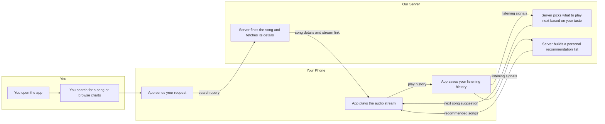

# Dreamin

Dreamin is a minimalist, ad-free music experience designed for private listening — built to make music feel uninterrupted, personal, and alive.

No algorithms pushing sponsored content. No skips limits. Just music, the way you want it.

## Screenshots

> Coming soon

## Why I Built This

Every major streaming app makes the same tradeoffs — ads between songs, discovery driven by what pays, a UI designed to keep you scrolling rather than listening. I wanted something different: an app that gets out of the way and just plays music.

Dreamin started as something I built for myself and a few friends. It's lean, fast, and doesn't care about engagement metrics.

## Features

- **Search & Stream** — Find and play songs instantly, streamed at 320kbps
- **Smart Queue** — Radio-style queue built from genre, artist, and language signals — no manual curation needed
- **Personalized Recommendations** — Suggestions that actually reflect what you've been listening to
- **Trending Charts** — Language-aware charts: Tamil, Hindi, English, Telugu, Malayalam
- **Lock Screen Controls** — Full playback controls on the lock screen and notification shade
- **Playlists & Favorites** — Organize music your way
- **Sleep Timer** — Schedule playback to stop automatically
- **Listening Stats** — Weekly stats, top songs, top artists
- **Multiple Themes** — Sonic Nocturne, Blue Hour, Rose Dusk, Forest Night

## Tech Stack

### Android
| Layer | Technology |
|-------|-----------|
| Language | Kotlin |
| UI | Jetpack Compose + Material 3 |
| Playback | Media3 / ExoPlayer + MediaSessionService |
| Networking | Retrofit + OkHttp |
| Local Storage | Room (database) + DataStore (preferences) |
| Image Loading | Coil + Palette API |
| Min SDK | 26 (Android 8.0) |

### Backend
| Layer | Technology |
|-------|-----------|
| Framework | FastAPI (Python 3.11) |
| Server | Uvicorn (ASGI) |
| HTTP Client | HTTPX (async) |
| Containerization | Docker |
| Deployment | ClawCloud via GitHub Actions |

## Architecture

```
Android App
├── MusicPlayerViewModel     — single StateFlow, all business logic
├── MusicService             — foreground service, ExoPlayer + MediaSession
├── Room Database            — playlists, favorites, history, stats
├── DataStore                — user preferences, chart cache
└── Retrofit                 — communicates with FastAPI backend
        │
        ▼
FastAPI Backend
├── Music aggregation layer  — metadata, streaming sources, artwork
├── Smart queue engine       — multi-source candidate ranking with language detection
├── Recommendation engine    — personalized suggestions from play history
└── In-memory cache          — TTL-based caching (charts: 6h, queue: 1h)
```

## System Architecture



### How It Works

| Step | What's happening |
|------|-----------------|
| 1 | You open Dreamin and search for a song or pick from the trending charts |
| 2 | Your phone sends that request to our server, which looks up the song's details and finds a working audio link |
| 3 | The audio streams directly to your phone at high quality — no waiting for a full download |
| 4 | As you listen, the app quietly notes which songs you played, skipped, or replayed |
| 5 | When a song is about to end, the server uses your listening history to pick the next song you are most likely to enjoy |
| 6 | If you ask for recommendations, the server compares your history against similar listeners and suggests songs you have not heard yet |
| 7 | Everything is stored privately on your device and our server — no ads, no third-party trackers |

---

## Getting Started

### Backend

**Run locally:**
```bash
cd backend
pip install -r requirements.txt
uvicorn app:app --host 0.0.0.0 --port 8080 --reload
```

**Run with Docker:**
```bash
cd backend
docker build -t dreamin-server .
docker run -p 8080:8080 dreamin-server
```

### Android App

1. Open the project in Android Studio (Hedgehog or newer)
2. Set your server URL in `app/src/main/java/com/shyan/dreamin/data/network/NetworkService.kt`:

```kotlin
// Emulator
var BASE_URL = "http://10.0.2.2:8080/"

// Physical device (same Wi-Fi as your machine)
var BASE_URL = "http://192.168.x.x:8080/"

// Production
var BASE_URL = "https://your-server-url.com/"
```

3. Hit **Run** in Android Studio

## API Reference

| Method | Endpoint | Description |
|--------|----------|-------------|
| GET | `/` | Health check |
| GET | `/api/mobile/health` | App health check |
| POST | `/api/mobile/register` | Register device |
| GET | `/api/mobile/search?q=` | Search songs |
| GET | `/api/mobile/chart?language=` | Trending chart |
| GET | `/api/mobile/play?id=&artist=&title=` | Get stream URL |
| GET | `/api/mobile/up_next?song_id=` | Queue suggestions |
| GET | `/api/mobile/recommend?song_id=` | Recommendations |

## Deployment

The backend auto-deploys to ClawCloud on every push to `main` that touches `backend/`.

**Required GitHub secrets:**

| Secret | Description |
|--------|-------------|
| `DOCKERHUB_USERNAME` | Docker Hub username |
| `DOCKERHUB_TOKEN` | Docker Hub access token |
| `CLAWCLOUD_DEPLOY_HOOK` | ClawCloud redeploy webhook URL |

## Project Structure

```
Dreamin/
├── app/                        # Android app
│   └── src/main/java/com/shyan/dreamin/
│       ├── data/
│       │   ├── local/          # Room database, DAOs, DataStore
│       │   ├── model/          # Data models
│       │   └── network/        # Retrofit API interface
│       ├── service/            # MusicService (ExoPlayer + MediaSession)
│       ├── viewmodel/          # MusicPlayerViewModel
│       └── ui/
│           ├── screens/        # Compose screens
│           └── theme/          # App themes and colors
├── backend/                    # FastAPI server
│   ├── app.py
│   ├── requirements.txt
│   └── Dockerfile
└── .github/workflows/          # CI/CD
    └── deploy-backend.yml
```

## What's Next

- Offline downloads — save songs for when you're off the grid
- Social listening — share what you're playing with friends
- Smarter recommendations — move beyond history-based signals toward taste modeling
- iOS support — same experience, different platform

## License

Personal project — not licensed for redistribution.
